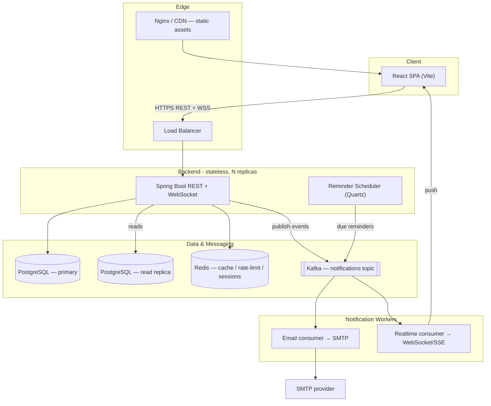
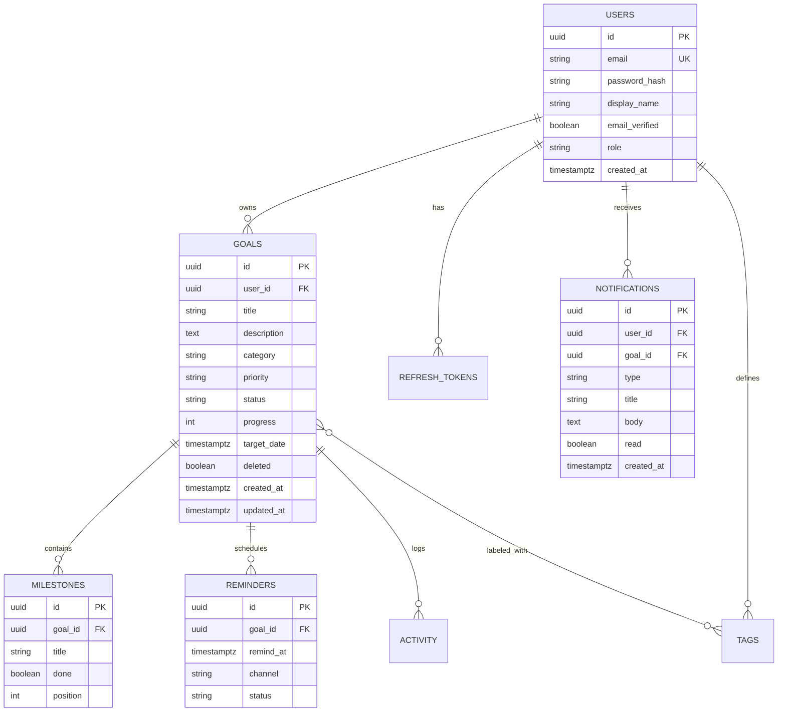
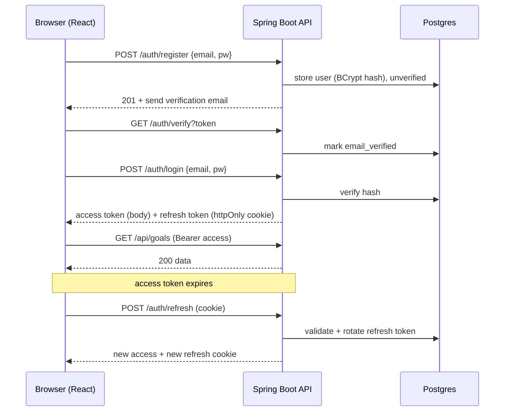
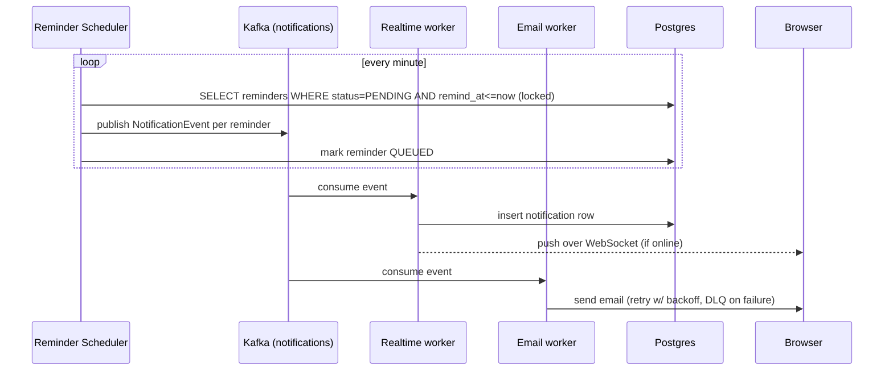

# Goalkeeper — System Design

A full-stack, multi-user goal-tracking web app: **React (Vite) + Spring Boot 3 + PostgreSQL**, with JWT auth, a reminder-driven notification system (in-app real-time + email), and a scalable, stateless backend.

---

## 1. Scope

### Functional requirements
- **Accounts & auth:** register, email verification, login, logout, token refresh, forgot/reset password, profile.
- **Goals:** create/edit/delete; each has title, description, category, priority, status, progress %, target date.
- **Milestones:** ordered sub-tasks per goal; checking them off drives goal progress.
- **Reminders:** up to *N* per goal at chosen date-times → fire notifications.
- **Notifications:** in-app (real-time bell + feed) and email; mark read; extensible to Web Push.
- **Dashboard:** completion rate, upcoming deadlines, streaks, category breakdown, activity over time (charts).
- **Organization:** tags/categories, full-text search, filter, sort, pagination.
- **Activity log:** per-goal history of changes.

### Non-functional requirements
- Secure by default (hashing, JWT, RBAC-ready, rate limiting, OWASP).
- **Stateless API** → horizontal scale behind a load balancer.
- Optimized data access (indexes, keyset pagination, caching, connection pooling).
- Async, decoupled notification delivery that survives spikes.
- Observability: health checks, metrics, structured logs.
- Responsive, accessible, polished UI.

---

## 2. High-level architecture



**Why this shape:** the API stays stateless (tokens carry identity, Redis holds shared state), so you scale it horizontally. The reminder scheduler and notification delivery are **decoupled through Kafka** — a burst of due reminders never blocks web requests, and email/realtime consumers scale and retry independently (dead-letter topic for failures). For a first deploy you can collapse Kafka + workers into an in-process async path and add Kafka when volume justifies it (design below supports both).

---

## 3. Data model



**Key indexing / performance choices**
- `goals (user_id, status, target_date)` — the main dashboard/list query.
- `reminders (status, remind_at)` — the scheduler polls "PENDING and due" cheaply.
- `notifications (user_id, read, created_at desc)` — the notification feed.
- UUID (v7 preferred, time-ordered) PKs to avoid hot-spotting and ease sharding later.
- Keyset (seek) pagination on lists instead of `OFFSET` for stable, fast paging.
- Soft-delete (`deleted`) so removals are recoverable and cheap.

---

## 4. Authentication & authorization

**Scheme:** short-lived **JWT access token** (~15 min, sent as `Authorization: Bearer`) + long-lived **refresh token** stored as an **httpOnly, Secure, SameSite cookie** and persisted *hashed* in the DB for rotation/revocation.



- **Password hashing:** BCrypt (cost 12).
- **Refresh rotation + reuse detection:** each refresh invalidates the old token; a replayed old token revokes the whole family (theft signal).
- **Spring Security:** stateless filter chain, custom `JwtAuthenticationFilter`, method-level `@PreAuthorize`. `role` column keeps it RBAC-ready (USER / ADMIN).
- **Guardrails:** rate-limit `/auth/*` (Redis bucket), lockout after repeated failures, generic error messages to avoid user enumeration.

---

## 5. Notification system

Two triggers produce notifications: **reminders coming due** and **domain events** (e.g. goal completed, milestone hit).



- **Scheduler** uses a locked/`SKIP LOCKED` query so multiple API replicas don't double-send.
- **Realtime** delivery via STOMP-over-WebSocket to a per-user channel; if the user is offline the notification simply waits in the feed and is fetched on next load.
- **Email** sent async with retry + dead-letter for durability.
- **Extensible channels:** add Web Push (VAPID) or SMS as new consumers without touching producers.
- **Simple-mode fallback:** for the initial build, swap Kafka for Spring `@Async` + an in-memory `ApplicationEventPublisher`; the worker interfaces stay identical, so upgrading to Kafka later is a config change, not a rewrite.

---

## 6. API surface (REST)

| Area | Method & path | Notes |
|---|---|---|
| Auth | `POST /auth/register` · `POST /auth/login` · `POST /auth/refresh` · `POST /auth/logout` | login sets refresh cookie |
| Auth | `GET /auth/verify` · `POST /auth/forgot-password` · `POST /auth/reset-password` · `GET /auth/me` | |
| Goals | `GET /api/goals` (filter/sort/paginate) · `POST /api/goals` · `GET/PUT/DELETE /api/goals/{id}` | keyset pagination |
| Progress | `PATCH /api/goals/{id}/progress` · `PATCH /api/goals/{id}/status` | |
| Milestones | `GET/POST /api/goals/{id}/milestones` · `PUT/DELETE /api/milestones/{id}` | reorder via `position` |
| Reminders | `GET/POST /api/goals/{id}/reminders` · `DELETE /api/reminders/{id}` | max N enforced |
| Notifications | `GET /api/notifications` · `PATCH /api/notifications/{id}/read` · `POST /api/notifications/read-all` · `WS /ws` | |
| Dashboard | `GET /api/dashboard/stats` | cached in Redis |
| Tags | `GET/POST /api/tags` · attach/detach on goal | |

All responses use a consistent envelope + RFC-7807 problem details for errors. Validation via `jakarta.validation`. DTO↔entity mapping via MapStruct (no entities leak over the wire).

---

## 7. Scalability & optimization

- **Stateless API + Redis** for shared state → add replicas freely behind the LB.
- **Read replica** for dashboard/list reads; primary for writes.
- **HikariCP** tuned pool; **keyset pagination**; targeted composite indexes (section 3).
- **Caching:** Redis for dashboard stats and hot lookups, with event-based invalidation; HTTP `ETag`/`Cache-Control` on cacheable GETs.
- **Async everything slow:** email, push, heavy aggregation off the request thread.
- **Kafka** decouples notification fan-out; consumers scale independently with retry + DLQ.
- **Containerized** (Docker), **Kubernetes-ready** with liveness/readiness probes and an HPA on CPU/latency.
- **Frontend** built to static assets, served via CDN; code-split routes, lazy charts.
- **Observability:** Spring Actuator + Micrometer → Prometheus; structured JSON logs; request tracing.

---

## 8. Tech stack

**Frontend:** React 18 + Vite · React Router · TanStack Query (server cache) · Tailwind CSS + a small component layer · Recharts · react-hook-form + Zod · Axios with refresh interceptor.

**Backend:** Spring Boot 3 (Java 17) · Spring Security · Spring Data JPA · PostgreSQL · Flyway · Redis · Spring WebSocket (STOMP) · JavaMail · Quartz (scheduling) · Kafka (optional fan-out) · MapStruct · Testcontainers.

**Infra:** Docker Compose (dev) · GitHub Actions CI/CD · Nginx · Kubernetes (optional prod).

---

## 9. Repository layout

```
goalkeeper/
├── backend/                     # Spring Boot
│   ├── src/main/java/com/aakash/goalkeeper/
│   │   ├── auth/                # controllers, JWT, security config
│   │   ├── user/                # entity, service, repo
│   │   ├── goal/                # goals, milestones, reminders
│   │   ├── notification/        # events, scheduler, workers, WS
│   │   ├── dashboard/           # aggregation + caching
│   │   └── common/              # error handling, config, mappers
│   └── src/main/resources/db/migration/   # Flyway
└── frontend/                    # React + Vite
    └── src/
        ├── api/                 # axios client, query hooks
        ├── auth/                # context, guards, login/register
        ├── components/          # UI kit
        ├── features/            # goals, dashboard, notifications
        └── routes/
```

---

## 10. Build phases

1. **Foundation** — Postgres + Flyway schema, Spring Security + JWT auth, register/login/refresh, React app shell with protected routes and login/register UI.
2. **Core goals** — goals + milestones CRUD, progress, list with filter/sort/pagination, goal detail UI, dashboard stats.
3. **Notifications** — reminders + scheduler, in-app real-time feed + bell, email delivery (async/in-process first).
4. **Polish & scale** — Redis caching, charts, activity log, tags/search, Kafka fan-out, Dockerization + CI, K8s manifests.

---

*Design choices lean on a stateless-API + Redis + Kafka spine specifically so this scales the way your Kafka/Kubernetes background already works — the notification pipeline is the part most worth decoupling, and it's built to grow from a single process to a multi-consumer fan-out without a rewrite.*
